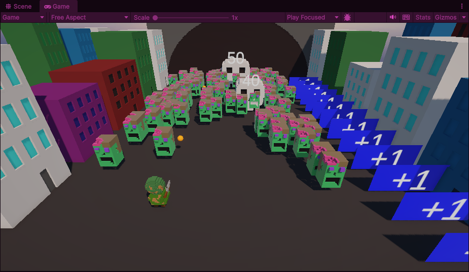
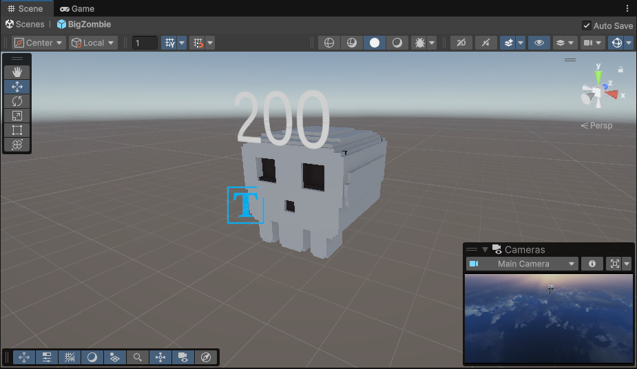

We're not exactly at the end of the first month, but I figured I'd post this now since I don't believe I'll have much more time this month. 

### Changelog

1. Added scaling to the number of hits the big zombies need go to down. 
1. Added a way to scale the size of the big zombies
1. Reworked zombies so they remove a solider instead of ending the game when they reach the bottom of the screen. Big zombies still end the game.
1. Added an animation when a zombie removes a solider
1. Added an animation where the big zombie stomps on the squad when it reaches the bottom of the screen
1. Increased the speed of the zombies based on the size of the squad.
1. Created original 3D models for the zombies, big zombies, and soldiers. In addition, I made some buildings and a tunnel in the background so it looks like the zombies are walking out of it instead of magically appearing
1. Added a title screen.
1. Added a fade transition between the title screen and the game. 

## Finding the Fun
After the last update I came to a hard conclusion: **the game quickly loses any sense of challenge.**

When starting the game it felt good to try and hold back the swarm with only a couple of soldiers. You had to make some tough choices between increasing your squad size or taking out that zombie on the far corner of the road. However if you could make it through the first 15 seconds of the game then you couldn't lose unless you tried. The sheer volume of projectiles your team unleashes is more than enough to keep the road under control. 

To help with this, I started making some changes to the speed of the zombies and spawn rate for the powerups. That helped a bit, but illuminated another problem in that the game was really unforgiving. One zombie making it to the end killed the run, no matter how well you were doing, which didn't feel right. 

It felt like there should be several opportunities for failure before ending the game altogether. That's precisely why I added #3, #4  from the Changelog. By removing a solider instead of the entire squad, that would allow the player to save a run after a bad call. While that helped, it's still really easy to snowball. I figured another way to handle it was by increasing the speed of the zombies as the squad size grew. It sort of helps in that it makes things a bit more challenging later on, but wasn't enough.

Ultimately, I believe there needs to be a way to constantly threaten the squad size, which would push the player to keep choosing between collecting powerups and handling the horde. I went back and forth changing numbers until I decided to switch things up by making some new assets. 

## The Title
I was making some buildings for the sides of the road, and figured I should do something abut the zombies appearing out of thin air. After some thought I figure I could have the zombies walk out of a large tunnel. After quickly creating and adding it to the scene, I was pretty happy with the result. So happy that I figured I could title the game after it, which is how we got **Zombie Tunnel**

## Why Just Zombie Heads?
This is more of a note for myself. But I didn't have a reason to make the zombies floating heads. They were actually the first thing I created in MagicaVoxel in a long time. I was on a Discord call with my partner while working on it, and she gave more than a few tips (she's an artist, so I'm sure looking at my attempts at art was a painful experience for her). We sort of just fell into making it a head. I liked what took shape and decided to run with it. After she left the call, I took a swing at making the big zombie. I figured instead of just scaling up the existing zombie head, I'd make a skull instead. So not only would the size be different, but the color palette and silhouette would also be distinct. 

## Wrapping Up
I was running out of time in the month, and figured I'd add a title screen scene, and a fade effect transitioning between the two scenes. 

The game is far from perfect, but considering this is the first in the year, I'm pretty happy with the start. Although I did miss out on adding sound effects. Furthermore I really think there's a way to keep the player from snowballing too early. There's a number of mechanics I can think of adding to help with this, but it's time to move on. 
